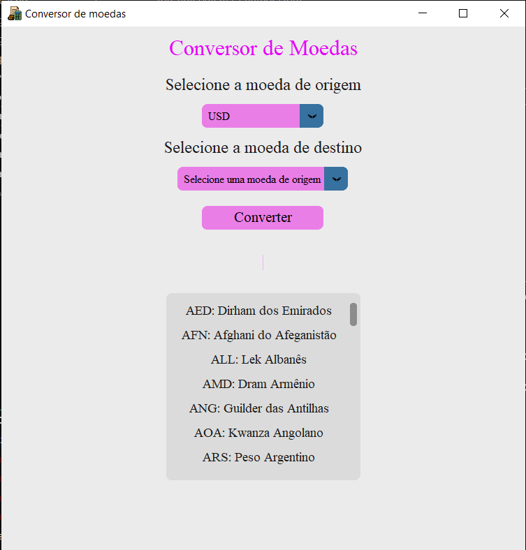

# Conversor de Moedas em Python
 
 
## Funcionalidades
O Conversor de Moedas desenvolvido pelo grupo, apresenta funções relacionadas a conversão dos valores de forma automática, que é feita a partir da seleção da moeda de origem, para a seleção da moeda de destino. A cotação requisitado é exibido a partir das escolhas, e atualizado a cada 30 segundos, tornando o aplicativo confiável e ágil. Ele apresentará: 
- Temas personalizados 
- Preview em tempo real
- Modo tela cheia
- Seleção de Moeda de destino e Origem 
- Conversão em tempo real 
- Diferentes Valores
 
 
## Instalação
Para a execução do conversor de moedas, será necessário que o python esteja instalado em seu dispositivo, realizando a instalação de três bibliotecas diferentes.
 
    
### Pré-requisitos
- customtkinter  
- requests
- xmltodict
 
### Instalação dos pré-requisitos
Usando o pip como código, será realizado a Instalação:
 
 
 
```bash
pip install customtkinter requests xmltodict
```
 
 
## Arquivos
- main.py: Janela principal onde se encontra todas as funcionalidades e customizações do conversor.
 
- pegar_moedas.py: Janela onde adere todas as moedas disponiveis.
 
- pegar_cotacao.py: Janela onde é adquirido os valores de cotação, para converter moeda_origem em moeda_destino.
## Screenshots
 

 
 
## Aprendizados
 
  A partir do desenvolvimento do Conversor de Moedas, foi possível analisar e compreender a instalação de diversos códigos para o pleno funcionamento da proposta, e integrar diversas fontes de instalação e sistemas para complementar o projeto, além disso fomos capazes de criar uma interface gráfica amigável e intuitiva para o conversor de moedas, utilizando bibliotecas como o CustomTkinter, o requests, o XML para a criação de documentos organizados e diversos outros.
Contudo o desenvolvimento desse projeto possui requisitos muitos complexos, que foi apenas viável realizar com a ajuda do professor, mas também pela paciência durantes as aulas. E para superar esses desafios, é necessário praticar a aplicação dos códigos e contar com a ajuda de um instrutor, afim de realizar projetos futuros.
 
 
## Autores
Grupo 8
 
- [@AnaSenna02](https://www.github.com/AnaSenna02)
- [@Laura270208](https://www.github.com/Laura270208)
- [@Amandaaraujo07](https://www.github.com/Amandaaraujo07)
- [@yasminramos08](https://www.github.com/yasminramos08)